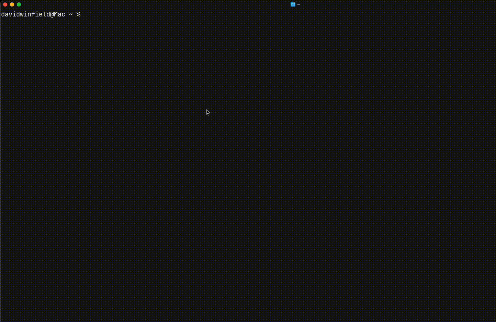

# Readme

This is a spaced repetition TUI to make it easier to practice + review Leetcode problems on a schedule

## App Demo

## TUI Features

- Fetch items due for review
- Add problems to your review cycle
- Open the problem in your browser
- Solve a problem + rate how easy it was
- Edit problems
- Delete problems
- Backup save data to github:
  - Pull from source on app start
  - Push to source on app quit
